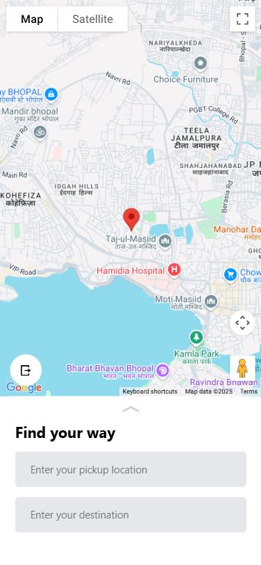
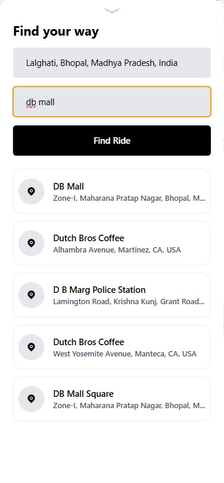
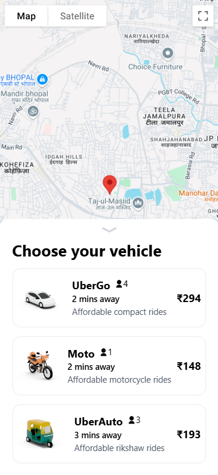
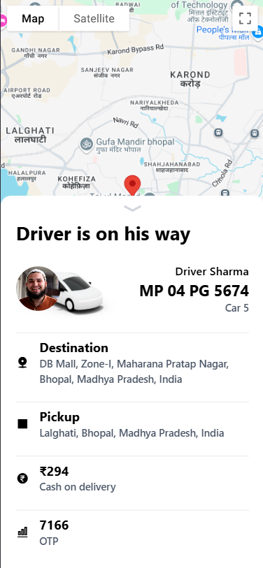
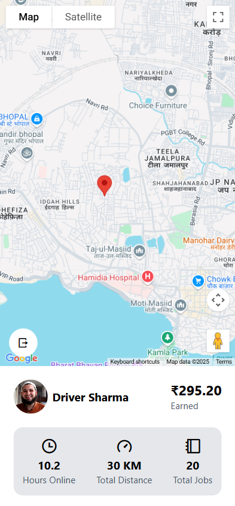
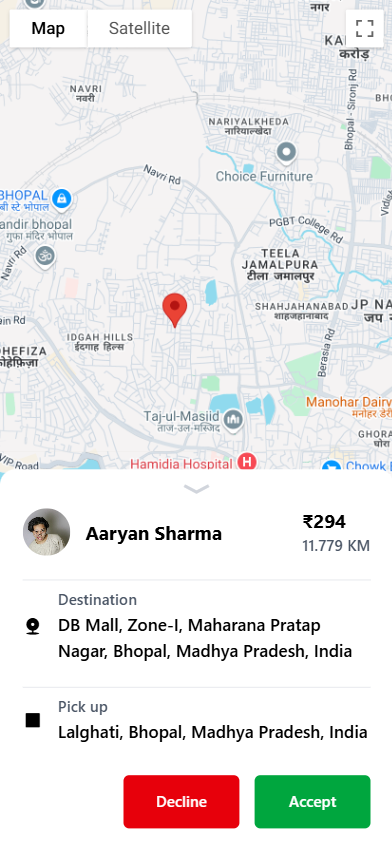
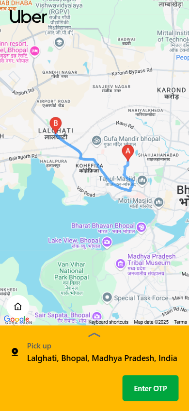
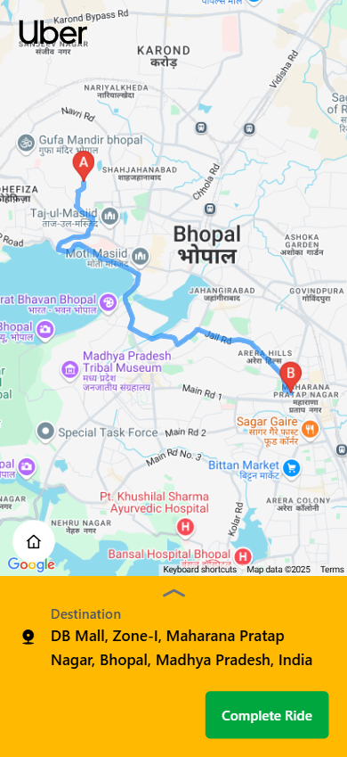

# Drivn - Frontend

This is the frontend of the Uber Application, providing a seamless and user-friendly interface for booking rides, tracking drivers, and managing user accounts.

## Technical Stack

- **HTML5** and **CSS3** for structure and styling.
- **JavaScript** for dynamic functionality.
- **React.js** (if applicable) for building reusable UI components.
- **WebSocket** for real-time communication.
- **REST APIs** for backend integration.
- **GSAP** for animations.
- **Axios** for making HTTP requests.
- **Tailwind CSS** for utility-first styling.
- **Lottie Files** for lightweight and scalable animations.

## Environment Variables

The application uses the following environment variables, which should be defined in a `.env` file:

- **`VITE_BASE_URL`**: The base URL for the backend API. This is used to make HTTP requests to the server.
- **`GOOGLE_MAPS_API_KEY`**: The API key for accessing Google Maps services, such as geocoding and map rendering.
- **`GOOGLE_MAPS_MAP_ID`**: The map ID for customizing the appearance of Google Maps.

Ensure these variables are correctly set in the `.env` file before running the application.

## Setup and Installation

Follow these steps to set up and run the frontend locally:

1. **Clone the Repository**  
   Clone the project repository to your local machine:

   ```bash
   git clone https://github.com/your-repo/uber-frontend.git
   ```

2. **Navigate to the Frontend Directory**  
   Change to the `Frontend` directory:

   ```bash
   cd Uber\ Application\Frontend
   ```

3. **Install Dependencies**  
   Install the required dependencies using npm or yarn:

   ```bash
   npm install
   ```

   or

   ```bash
   yarn install
   ```

4. **Start the Development Server**  
   Run the development server to start the application:

   ```bash
   npm start
   ```

   or

   ```bash
   yarn start
   ```

5. **Access the Application**  
   Open your browser and navigate to `http://localhost:5173` to view the application.

## Important Endpoints

The application interacts with the backend using the following key endpoints:

### User Endpoints

- **`POST /api/user/signup`**: Endpoint for user registration.
- **`POST /api/user/login`**: Endpoint for user login.
- **`POST /api/user/logout`**: Endpoint for logging out the user.
- **`GET /api/user/rides`**: Fetches the list of rides for the user.

### Captain Endpoints

- **`POST /api/captain/signup`**: Endpoint for captain registration.
- **`POST /api/captain/login`**: Endpoint for captain login.
- **`POST /api/captain/logout`**: Endpoint for logging out the captain.
- **`GET /api/captain/rides`**: Fetches the list of rides assigned to the captain.

### Ride Management Endpoints

- **`POST /api/rides/request`**: Endpoint for users to request a ride.
- **`POST /api/rides/accept`**: Endpoint for captains to accept a ride request.
- **`POST /api/rides/complete`**: Marks a ride as completed.

These endpoints are used throughout the application to manage user and captain interactions, as well as ride-related operations.

## Application Screenshots

You can showcase the application's UI by adding screenshots in this section. Below is an example format:

### User Home Page



### User Location Panel



### User Vehicle Options



### User Ride Confirmed Panel



### Captain Home Page



### Captain Popup Panel



### Captain Pickup Page



### Captain Destination Page/ User Riding Page



### Ride Completed Panel


## Best Features

This application offers the following standout features:

- **User Authentication**: Secure signup and login functionality for both users and captains.
- **Real-Time Updates**: Live ride tracking and updates using WebSocket.
- **Interactive Maps**: Integration with Google Maps for ride navigation and location tracking.
- **Responsive Design**: Fully responsive UI built with Tailwind CSS for seamless usage across devices.
- **Animation Effects**: Smooth and engaging animations powered by GSAP.
- **Captain and User Dashboards**: Separate dashboards for captains and users to manage rides and profiles.
- **Ride Management**: Features like ride requests, pickups, and destination tracking for captains.
- **Logout Functionality**: Easy and secure logout options for both users and captains.

## Contribution

Feel free to contribute to this project by submitting issues or pull requests.
